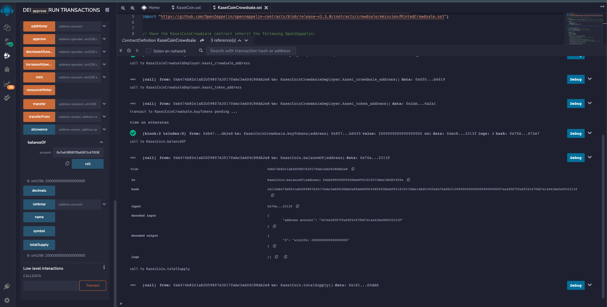

# Challenge_21

KaseiCoin

The goal of this project was to build and deploy the contracts required to create a new token, the KaseiCoin, ad deploy it to a test Ethereum network with the ultimate goal of being used as a new cryptocurrency on Mars. To complete this task, a contract was written to create the KaseiCoin using inherited compliance with ERC20. Next, the Crowdsale and CrowdsaleDeployer contracts were written to allow the coin and the crowdsale to be deployed to the blockchain network and allow new accounts to interact with and buy the created KaseiCoin. 

---

## Technologies

This project was built using Solidity within the Remix IDE. In addition to the base Solidity libraries, the following were imported to ensure ERC20 compliance.

   [ERC20](https://github.com/OpenZeppelin/openzeppelin-contracts/blob/release-v2.5.0/contracts/token/ERC20/ERC20.sol)

   [ERC20Detailed](https://github.com/OpenZeppelin/openzeppelin-contracts/blob/release-v2.5.0/contracts/token/ERC20/ERC20Detailed.sol)

   [ERC20Mintable](https://github.com/OpenZeppelin/openzeppelin-contracts/blob/release-v2.5.0/contracts/token/ERC20/ERC20Mintable.sol)
   
   [Crowdsale](https://github.com/OpenZeppelin/openzeppelin-contracts/blob/release-v2.5.0/contracts/crowdsale/Crowdsale.sol)
   
   [MintedCrowdsale](https://github.com/OpenZeppelin/openzeppelin-contracts/blob/release-v2.5.0/contracts/crowdsale/emission/MintedCrowdsale.sol)
   

---

## Installation Guide

In addition to using the online Remix IDE, this project requires the use of MetaMask and Ganache. These two programs can be downloaded, installed ans setup using the following links.

  [Ganache](https://trufflesuite.com/ganache/)
  
  [MetaMask](https://metamask.io/download/)

---

## Usage

With all of the required programs installed and running, the user can begin the deployment by connecting MetaMask with the test network deployed by Ganache and the Remix IDE. Next the user will connect at least one account to use when deploying and testing the contracts by importing the account from Ganache in MetaMask with its private key. Finally the user can begin the deployment and interaction detailed in the section below.  

---

## Evaluation Evidence

### Compile KaseiCoin.sol

### Compile KaseiCoinCrowdsale.sol

### Compile KaseiCoinCrowdsaleDeployer

### Deploy KaseiCoin Using KaseiCoinDeployer Contract

### Buy KaseiCoin Using Test Account

### Check BalanceOf Test Account

### Check Total Supply of KaseiCoin

### Check Wei Raised by Contract

---

## Contributors

Briggs Lalor
email: briggsclalor@gmail.com

---

## License

MIT License

Copyright (c) [2022] [Briggs Lalor]

Permission is hereby granted, free of charge, to any person obtaining a copy
of this software and associated documentation files (the "Software"), to deal
in the Software without restriction, including without limitation the rights
to use, copy, modify, merge, publish, distribute, sublicense, and/or sell
copies of the Software, and to permit persons to whom the Software is
furnished to do so, subject to the following conditions:

The above copyright notice and this permission notice shall be included in all
copies or substantial portions of the Software.

THE SOFTWARE IS PROVIDED "AS IS", WITHOUT WARRANTY OF ANY KIND, EXPRESS OR
IMPLIED, INCLUDING BUT NOT LIMITED TO THE WARRANTIES OF MERCHANTABILITY,
FITNESS FOR A PARTICULAR PURPOSE AND NONINFRINGEMENT. IN NO EVENT SHALL THE
AUTHORS OR COPYRIGHT HOLDERS BE LIABLE FOR ANY CLAIM, DAMAGES OR OTHER
LIABILITY, WHETHER IN AN ACTION OF CONTRACT, TORT OR OTHERWISE, ARISING FROM,
OUT OF OR IN CONNECTION WITH THE SOFTWARE OR THE USE OR OTHER DEALINGS IN THE
SOFTWARE.
